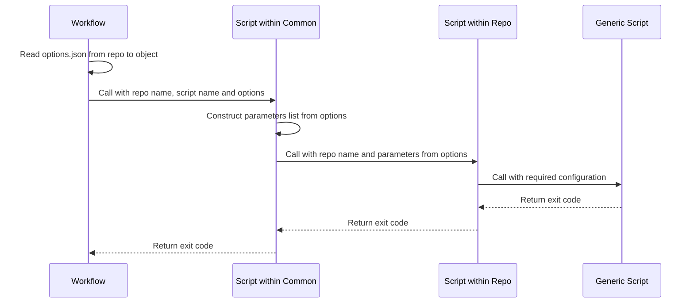
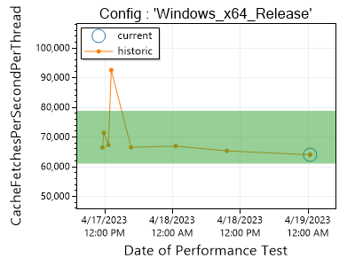

# Design

This document lays out the overall design of continuous integration in this repository.

## Structure

### Workflows

Workflows are the overall scripts which achieve a goal of CI. For example, one workflow will
run all the tests required to merge a pull request, then complete the pull request.
Workflows mainly focus on the order of steps, and the actual work is done by individual steps.
Workflows are implemented in both PowerShell, and GitHub Actions.
A table of workflows can be found in [Readme](./README.md).

Workflows contained in this repository are reused by all 51Degrees repositories to avoid repetition. See [reusing workflows](https://docs.github.com/en/actions/using-workflows/reusing-workflows).

In addition to PowerShell scripts, the [EnricoMi/publish-unit-test-result-action/composite](https://github.com/EnricoMi/publish-unit-test-result-action)
action is used to display test results nicely in the run summary, and link as a check in related PRs.
The action requires Python, so it's wrapped in a [custom composite action](.github/actions/publish_test_results/action.yml)
which installs the supported version of Python before calling the action. This makes it independent
of the Python version that may have been installed on the runner in an earlier step.

### Steps

Steps are the scripts called by workflows. Almost exclusively implemented in PowerShell. The only
exception is setting up an environment, which is a set up step when running in GitHub Actions.
Details of the steps can be found in [Readme](./README.md)

Scripts should be written to support PowerShell 7.

### Scripts and Their Locations

| root scripts |
| ------------ |
| `nightly-data-file-change.ps1` |
| `nightly-package-update.ps1` |
| `nightly-pr-to-main.ps1` |
| `nightly-publish-main.ps1` |
| `nightly-submodule-update.ps1` |
| `nightly-documentation-update.ps1` |
| `monthly-copyright-update.ps1` |

| scripts in `.github/workflows` |
| ------------------------------ |
| `nightly-data-file-change.yml` |
| `nightly-package-update.yml` |
| `nightly-pr-to-main.yml` |
| `nightly-publish-main.yml` |
| `nightly-submodule-update.yml` |
| `nightly-documentation-update.yml` |
| `monthly-copyright-update.yml` |

*NOTE: The scripts above call the root PowerShell workflow scripts.*

| scripts in `steps` |
| ------------------ |
| `checkout-pr.ps1` |
| `clone-repo.ps1` |
| `commit-changes.ps1` |
| `compare-performance.ps1` |
| `configure-git.ps1` |
| `download-data-file.ps1` |
| `fetch-csv-assets.ps1` |
| `fetch-hash-assets.ps1` |
| `get-next-package-version.ps1` |
| `gunzip-file.ps1` |
| `has-changed.ps1` |
| `merge-pr.ps1` |
| `package-update-required.ps1` |
| `pull-request-to-main.ps1` |
| `push-changes.ps1` |
| `run-repo-script.ps1` |
| `update-sub-modules.ps1` |
| `update-tag.ps1` |

See [Steps Readme](./steps/README.md)

| scripts in `environments` |
| ------------------------- |
| `setup-msbuild.ps1` |

See [Environments Readme](./environments/README.md)

| scripts in `dotnet`, `java`, `node`, `php`, `python`, `go`, `c`, and `cxx` |
| -------------------------------------------------------------------------- |
| `build-project.ps1` |
| `get-next-package-version.ps1` |
| `build-package.ps1` |
| `package-dependency-update.ps1` |
| `publish-package.ps1` |
| `run-unit-tests.ps1` |
| `run-integration-tests.ps1` |
| `run-performance-tests.ps1` |

*NOTE: the scripts in the above table are less strict in their naming, and can vary slightly between languages. For example dotnet will have build-project-core.ps1 and build-project-framework.ps1*

See [CXX](./cxx/README.md). **TODO: Add others as they are completed**

| scripts in `[repository]/ci` |
| ---------------------------- |
| `build-project.ps1` |
| `build-package.ps1` |
| `build-package-requirements.ps1` |
| `fetch-assets.ps1` |
| `get-next-package-version.ps1` |
| `install-package.ps1` |
| `package-dependency-update.ps1` |
| `publish-package.ps1` |
| `run-integration-tests.ps1` |
| `run-performance-tests.ps1` |
| `run-unit-tests.ps1` |
| `setup-environment.ps1` |
| `options.json` |

*NOTE: these files in the table above MUST exist in the repository the workflow is run against, as they are called by the workflow. If a step is not relevant for a repository, then the file should do nothing and return a zero exit code.*

See [Repository Scripts](./REPO_SCRIPTS.md).

### Passing Variables

Input variables are passed to scripts in the standard way for PowerShell scripts.

Output variables are handled in one of two ways. Where possible, exit codes are used. Zero for
success, and non-zero otherwise. This should always be checked by the calling script, using
`$LASTEXITCODE`. Where more complex values are required, a variable name is passed as an input
parameter, and the parameter is set within the script using the `Set-Variable` function, using
`-Scope 1` so it is available to the caller (and only the caller).


### Inversion of Control

By using the principals of inversion of control, many of the scripts can be generic, thus avoiding
duplication. The non generic part which must be provided to a workflow is the name of the repository
it is running on. This repository then defines exactly what it wants to do, using the common steps
as much as possible. This design means that there can be a single workflow, which can be run of many
repositories, and does not need to be specific about the language in it's design.

An example of a fully generic step is cloning a repository, or creating a pull request.
An example of a step which relies on inversion of control is building or testing a project.

Generally, the order of execution is:
1. Workflow is called with a repo name,
2. Workflow calls a script within the repo (e.g. build) with any configuration required,
3. The script within the repo then calls a generic script with the configuration required.

For example, for the pipeline-dotnet repository, the build step would look something
like:
1. Workflow calls `pipeline-dotnet/ci/build-project.ps1` with the build configuration e.g. `x64` and `Debug`,
2. That script then calls `dotnet/build-project.ps1` with the build configuration,
3. If the build succeeds, an exit code of 0 is returned, and this repeats all the way up.



### Build Options

Build options are configured in a common way across all repositories. Each repository has an options file in `ci/options.json` which is used by the workflows when calling build and test steps. Each element in an options item will be passed into the repo specific script as a parameter if the name matches and of the script parameters.

This contains a list of setups to build and test against. Each language may have different requirements for what is in each option, however the `Name` is required in all languages.

The common options available are listed below:

| Option | Mandatory | Type | Purpose |
| ------ | :-------: | ---- | ------- |
| `Name` | &check;   | string | Identifies the workflow jobs, and any artifacts which are created. |
| `RunPerformance` | | bool | If present and true, performance tests will be run and reported for this configuration. |
| `PackageRequirement` | | bool | If present and true, this will be used for the prebuild step in `nightly-publish-main` |

Workflows that build and test a repository will do so for each of the configurations listed in the options file.

An example of an options file is:

```json
[
    {
        "Name": "Debug_x64",
        "Configuration": "Debug",
        "Arch": "x64"
    },
    {
        "Name": "Debug_x86",
        "Configuration": "Debug",
        "Arch": "x86"
    }
]
```

Some languages which do not have an overarching solution file for multiple project in a repository may use these options to list the packages to build. For example, in node, a configuration could look like:
```json
{
    "Name": "project1",
    "Project": "./project1" // the path within the repo to one of the projects.
}
```

An example of a repo specific script consuming these options is:
```powershell
param (
    [string]$Name,
    [string]$Configuration,
    [string]$Arch
)
# Do some building with these options.
```
Note that the options object is not passed in "as is". It is parsed by `run-repo-script.ps1`, and the correct parameters populated.


### Asset Caching

Some repositories need additional assets for running tests, which are fetched by the `fetch-assets.ps1` script.
Workflows that may need assets optinally support asset caching. To use it, a caller must set the `cache-assets` input
flag to `true`, and make sure that the assets are located in the `${{ github.workspace }}/common/assets` directory. If
repository requires assets to be located in a different place, [symbolic links](https://learn.microsoft.com/en-us/powershell/module/microsoft.powershell.management/new-item?view=powershell-7.2#example-7-create-a-symbolic-link-to-a-file-or-folder)
or regular file copies may be used to put cached assets in the right places during build.

The hash of the `asset-keys` secret, with current date prepended, is used as the cache key so that the cache gets
invalidated daily, as well as when any of the asset keys change.


## Entering Directories

Most steps are run from within a repository that has been cloned by the workflow. To ensure that
the correct working directory is always maintained, the following pattern is used:

```powershell
Push-Location $RepoPath

try {

    # Here is where we carry out the logic in the repository
    # directory.

}
finally {

    Pop-Location

}

exit $LASTEXITCODE
```

## Orchestration

Workflow PowerShell scripts should be in control of as much of the orchestration of steps as possible.
The basic format of this is along the lines of:

```pwsh
Write-Output "::group::Configure Git"
./steps/configure-git.ps1 -GitHubToken $GitHubToken
Write-Output "::endgroup::"

if ($LASTEXITCODE -ne 0) {
    exit $LASTEXITCODE
}

Write-Output "::group::Clone $RepoName"
./steps/clone-repo.ps1 -RepoName $RepoName
Write-Output "::endgroup::"

if ($LASTEXITCODE -ne 0) {
    exit $LASTEXITCODE
}

## The rest of the steps...

exit 0
```

The YAML scripts then call these scripts, filling in the parameters from either constants or GitHub secrets:

```yml
steps:
  - name: Checkout Repository
    uses: actions/checkout@v2
    
  - name: Checkout reusable workflow dir
    uses: actions/checkout@v2
    with:
      repository: 51degrees/common-ci
      path: common
    
  - name: Some PowerShell Workflow
    shell: pwsh
    working-directory: ${{ github.workspace }}/common/
    run: |
      . ${{ github.workspace }}/common/some-powershell-workflow.ps1 `
      -GitHubToken ${{ secrets.token }} `
      -RepoName ${{ inputs.repo-name }}
```

There are cases where PowerShell workflows need to be broken up in order to use some logic specific to GitHub actions.
For example, testing on multiple platforms is carried out by separating jobs and passing variables:

```yml
jobs:
  Configure:
    runs-on: ubuntu-latest
    outputs:
      # Output from this job
      options: ${{ steps.get_options.outputs.options }}
    steps:
      # Common steps are omitted here for brevity
      - name: Get Build Options
        id: get_options
        shell: pwsh
        working-directory: ${{ github.workspace }}/common/
        run: |
          $OptionsFile = [IO.Path]::Combine($pwd, "${{ inputs.repo-name }}", "ci", "options.json")
          $Options = Get-Content $OptionsFile -Raw
          $Options = $Options -replace "`r`n", "" -replace "`n", ""
          # Output the options from options.json
          Write-Output options=$Options | Out-File -FilePath $Env:GITHUB_OUTPUT -Encoding utf8 -Append
          
  Test:
    needs: Configure
    strategy:
      matrix:
        # Input from the previous job
        options: ${{ fromJSON(needs.configure.outputs.options ) }}
    name: Test - ${{ matrix.options.name }}
    runs-on: ${{ matrix.options.image }}
    
    steps:
      # Common steps are omitted here for brevity
      - name: Some Test Workflow
        shell: pwsh
        working-directory: ${{ github.workspace }}/common/
        run: |
          . ${{ github.workspace }}/common/some-powershell-workflow.ps1 `
          -GitHubToken ${{ secrets.token }} `
          -RepoName ${{ inputs.repo-name }} `
          -Options $(ConvertFrom-Json -AsHashtable '${{ toJSON(matrix.options) }}')
```

## Logging

Logging should be carried out using `Write-Output`, unless it is a warning or an error, in which case `Write-Warning` and `Write-Error` are used respectively.

When calling steps from a workflow scripts, each script should be surrounded by the following format logs to separate them in GitHub actions output:
```sh
::group::Name of Step
## Output from step...
::endgroup::
```

## Dry Run

A `DryRun` parameter is passed to all the steps which could write changes to git or package managers. This includes `run-repo-script`, as a repo script could do this.
If the parameter is `true`, then any write operations should just be logged rather than executed. An example of this is:
```pwsh
$Command = "git push origin"
if ($DryRun -eq $False) {
  Invoke-Expression $Command
}
else {
  Write-Output "Dry run - not executing the following: $Command"
}
```

The parameter can be set when running from GitHub, and is passed to the scripts.

## Testing

## Integration Tests

The principal of integration tests is to test the package as a user would. I.e. the tests should not be run
from within a project, but instead be separate, and depend to the package built from the project.

To achieve this, the arrangement of integration tests is as follows:
1. Examples exist in a separate repository to the project they are demonstrating,
2. Examples reference packages using the relevant package manager e.g. NuGet, NPM, etc.,
3. Integration tests build the package, and deploy somewhere local (or a staging endpoint),
4. Integrations tests then clone the examples, update the references, and point to the staging source,
5. Examples are run as tests to confirm that the package works as intended.

## Performance Tests

Performance tests should output their results in a common format. This is then picked up by the workflow to compare with historic results.

The format of results must contain two objects, `HigherIsBetter` and `LowerIsBetter`. These each contain metrics and their values where higher or lower values mean a better metric respectively.

Note that single quotes (`'`) must be used, not double (`"`)

An example of this is:
```json
{
    'HigherIsBetter': {
        'ResultsPerSecond': 100,
        'OtherResultsPerSecond': 200
    },
    'LowerIsBetter': {
        'SecondsPerResult': 0.001
    }
}
```

The JSON formatted results should be written to the `test-results/performance-summary/results_[name].json` directory within the cloned repo, where `[name]` is the configuration name from `options.json`.

Results are automatically picked up by the `nightly-pr-to-main` workflow, and written to artifacts. Past artifacts are then downloaded to find ones which match the same configuration name. Each metric is then plotted and written to the summary.



As performance tests in CI can be inconsistent, an absolute value is not tested. Instead, an increase (or decrease depending on the metric) from the mean by more than two standard deviations is considered a failure. An area is added to the plot to show one standard deviation either side of the mean.

If the test passes, then the successful results are written to an artifact. Only successful results are used when getting past results. This prevents a performance degradation from changing the mean and deviation, which in turn could allow future degradations to pass this test.

Note that if there are less than ten data points, it is not considered a failure, but a warning is logged.
