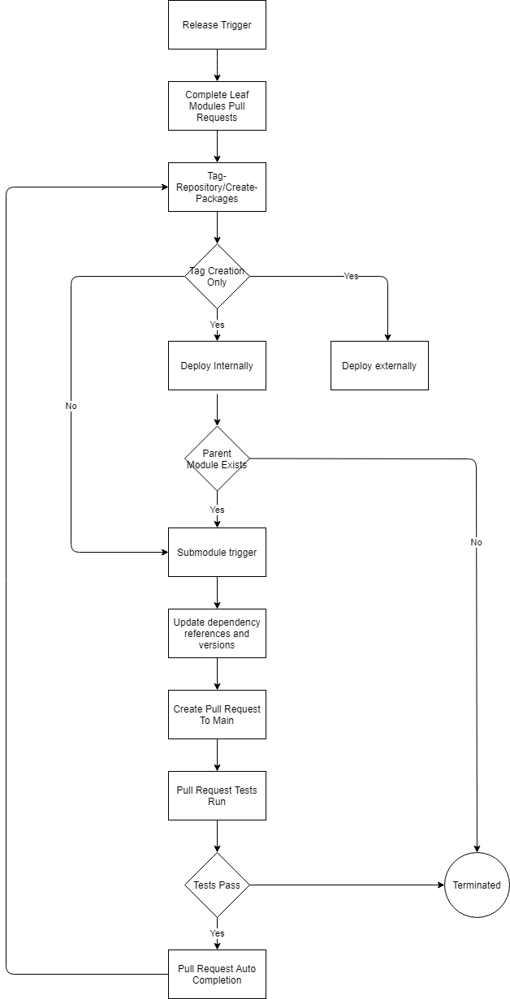

# Common-CI
Common-CI project contains a guideline for creation of continuous integration scripts and describes a general approach to continuous integration within 51Degrees. This readme should provide a comprehensive overview of rules and conventions to be expected from existing jobs and which should be followed when new jobs are created.

# Table of content
- [Common-CI](#common-ci)
- [Table of content](#table-of-content)
- [Reasoning](#reasoning)
- [Continuous integration](#continuous-integration)
  - [Approach](#approach)
    - [Overview](#overview)
    - [Build and test](#build-and-test)
    - [Create packages](#create-packages)
  - [Naming convention](#naming-convention)
    - [Azure DevOps Pipelines](#azure-devops-pipelines)
  - [Development guideline](#development-guideline)
    - [Microsoft Azure DevOps Pipelines](#microsoft-azure-devops-pipelines)
    - [YML file](#yml-file)
    - [Build and test platforms](#build-and-test-platforms)
    - [Testing principles](#testing-principles)
    - [Additional documentation](#additional-documentation)
    - [APIs common templates](#apis-common-templates)
- [Continuous deployment](#continuous-deployment)
  - [Configuration](#configuration)
    - [Internal package managers](#internal-package-managers)
  - [Release process](#release-process)
    - [Packages release](#packages-release)
    - [External package managers and public repositories](#external-package-managers-and-public-repositories)
  - [Automation](#automation)
    - [Automated Release Scripts](#automated-release-scripts)
    - [Flow Chart](#flow-chart)
  - [Naming convention](#naming-convention-1)
    - [Azure DevOps Pipelines](#azure-devops-pipelines-1)
- [License](#license)

# Reasoning
In order to keep high hygiene of development work and have clear indication of successful build, test and package creation, a common set of rules should be followed to measure the quality in a consistent manner across all of the projects. The main reason for having continuous integration in 51Degrees is to assure the best possible quality of software products by confirming successful execution of unit, functional, regression and example tests whenever change to the code base is made. Apart from the code related test, other measures prove the quality of software development through verification of successful execution of build and test processes on all supported platforms and architectures. 

 The reason for this document is to describe the technical solutions used for continuous integration in 51Degrees as well as provide a clear guidance on common rules across: 
- Naming conventions;
- Compulsory elements of CI scripts;
- Platforms and environments;
- Requirements for additional documentation;

# Continuous integration
## Approach
### Overview 
This section describes the general approach to continuous integration in 51Degrees. 

As an internal repository management system 51Degrees is using the Azure DevOps services and continuous integration is achieved through Azure DevOps Pipelines. Each pipeline is defined by a single or multiple `yml` scripts. High maintainability of continuous integration is achieved by keeping the tasks shared between the jobs in separate `yml` scripts and reuse them when possible to avoid code duplications and “copy & paste” errors.

51Degrees is using continuous software development practices described in principle as [Gitflow Workflow](https://www.atlassian.com/git/tutorials/comparing-workflows/gitflow-workflow).

At least two main continuous integration jobs should be provided for each software project/repository:
- “[Build and test](#build-and-test)”, and
- “[Create packages](#create-packages)”

Binaries built by continuous integration should be configured to perform a release built by default. If debug build configuration is required, additional, explicit jobs should be created to clearly indicate that pipeline output will be in debug mode.

### Build and test
Build and test job should be used for general purpose building and testing process, and should be the initial step of “Build, test and publish”. Continuous integration should be configured to automatically trigger this type of job whenever pull request is created regardless of the destination branch. Job should be automatically performed whenever any code change is made to the active pull request.

Build and test job provides tasks required for the project to build and run unit and regression tests. This job usually runs a sequence of tasks:
- Configuration<br />
This task (or tasks) configures the environment to meet the build requirements. Task should install all dependencies and platform specific packages required for the build and test processes.
- Code checkout<br />
Task to checkout the source code from the version control system. 51Degrees is using Git repositories hosted on Azure DevOps platform: `git clone` with, where required, submodules initialisation (`git submodule update --init --recursive`) should be used.
- Build<br />
Language and project specific build tool execution. 
- Test (and publish the results)<br />
Language and project specific unit, functional, example, or regression testing execution.

Set of tasks may differ between projects due to a requirement of individual approach for language or platform specific solutions. If an individual solution is in place, it should be documented in the `ci/readme.md` file of the given project.

Job <b>must</b> indicate a <b>fail state</b> if any of the following occurs:
- Configuration step fails on installation of any of the dependencies
- Code checkout step fails regardless of the reason
- Build step fails with error or warning - all warnings should be treated as errors
- Any test fails

If multiple operating system platforms should be supported according to [version support table](https://51degrees.com/documentation/_info__version_support.html) “Build and test” job should either:
- implement support for each operating system in a single `yml` file, or
- implement support for each operating system in a separate `yml` file and create a combining `yml` script.

General guideline for selecting the approach is to keep the `yml` file in a consumable size; if environment configuration, build, test, and any platform specific tasks sums up to more than 4 tasks - create a separate `yml` file. Try to use multi-platform matrix configuration whenever possible, more details can be found in [Microsoft documentation](https://docs.microsoft.com/en-us/azure/devops/pipelines/get-started-multiplatform?view=azure-devops)

<i>Note: Build and test job should be configured in a separate `yml` file to allow performing the set of tasks defined in this job as a part of "Build, test and publish" job.</i>

### Create packages
Create packages job should be used for creation of packages or tagging the repository and continuous integration system should be configured to automatically execute this job whenever pull request from `release` or `hotfix` branch is merged to `main` branch (as described in  [gitflow workflow](https://www.atlassian.com/git/tutorials/comparing-workflows/gitflow-workflow)).

Create packages job performs any tasks required for creation of packages and/or repository version tag. This job usually runs a sequence of tasks which differ for creating the packages and tagging the repository. <br />

Typical tasks for packages creation:<br />
- Package creation<br />
Language and project specific task generating the packages for given language and/or platform. This task should be documented in project specific `ci/readme.md` file.
- Digital signing<br />
This task should digitally sign the generated binaries or packages to assure a high level of quality and trust for the end user.
- Publish artifacts<br />
Packages or binaries produced by [Build, test and publish](#build,-test-and-publish) job should be published as artifacts of the Azure DevOps Pipeline execution. This task is important to support a smooth release process where the product of this step is used as the final release package.

Typical tasks for creating a repository tag:<br />
- Determine repository version number<br />
This step should determine the version number to be used for repository tagging. 51Degrees is using [GitVersion](https://gitversion.readthedocs.io/en/latest/input/docs/build-server-support/build-server/azure-devops/) Azure DevOps plugin to identify the repository version based on the [gitflow workflow](https://www.atlassian.com/git/tutorials/comparing-workflows/gitflow-workflow).
- Tag the repository<br />
Perform `git tag` operation on the repository using the version number determined in the previous step and `push` the newly created tag to remote.

Job <b>must</b> indicate a <b>fail state</b> if any of the following occurs:
- Package creation fails
- Digital signature process fails
- Artifacts cannot be found or published

## Naming convention
### Azure DevOps Pipelines
There are two main jobs per pipeline: `build and test`, and `create packages` the common naming convention is as follows:
- For “build and test” job:<br />
`<package-name>-test` where `<package-name>` represents dash-separated repository name; for example for repository `pipeline-python`, “build and test” job name should be configured as `pipeline-python-test`.
- For “create packages” job when packages are created:<br /> `<package-name>-create-packages`, where `<package-name>` represents dash-separated repository name; for example for repository `pipeline-python`, “build, test and publish” job name should be configured as `pipeline-python-create-packages`.
- For “create packages” job when repository is only tagged:<br />
`<package-name>-tag-repository`, where `<package-name>` represents dash-separated repository name; for example for repository `location-php`, “build, test and publish” job name should be configured as `location-php-tag-repository`.
- For jobs in debug configuration:<br />
`<package-name>-<job>-debug`, where `<package-name>` represents dash-separated repository name, `<job>` represents job suffix selected above; for example for repository `device-detection-dotnet`, “build, test and publish” job in `debug` the name should be configured as `device-detection-dotnet-create-packages-debug`.

## Development guideline
### Microsoft Azure DevOps Pipelines
Detailed documentation and useful information about Azure DevOps pipelines can be found in [Microsoft documentation](https://docs.microsoft.com/en-us/azure/devops/pipelines/?view=azure-devops).
### YML file
YAML Ain't Markup Language configuration files are used to configure Azure DevOps continuous integration pipelines and more details about how to use them can be found in [Microsoft documentation](https://docs.microsoft.com/en-us/azure/devops/pipelines/yaml-schema?view=azure-devops&tabs=schema%2Cparameter-schema).


This guideline obligates the CI developer to add comments to any tasks defined in `yml` files that are not self descriptive and requires more information to understand the implemented process. Follow the general rule that “if in doubt - comment” and always ask for peer review in order to address any concerns or possible misunderstandings. 

Comments in `yml` files are achieved by `#` character prefix, for example:<br />
Visual Studio build task from `pipeline-dotnet` project:
```
- task: VSBuild@1
  displayName: 'Build solutions'
  inputs:
    solution: '$(RestoreBuildProjects)'
    vsVersion: '15.0'
    platform: 'Any CPU'
    configuration: '$(BuildConfiguration)'
    clean: true
```
Although relatively self descriptive, could be extended by comments:
```
# Visual studio build task - VS2017 configuration
- task: VSBuild@1
  displayName: 'Build solutions' # defines name of the task displayed in Azure DevOps
  inputs: # Task specific inputs
    solution: '$(RestoreBuildProjects)' # Location of solution file obtained from RestoreBuildProjects variable set by previous NuGet restore step
    vsVersion: '15.0' # Version of Visual Studio to be used (version 15.0 is VS2017)
    platform: 'Any CPU' # Target platform 
    configuration: '$(BuildConfiguration)' # Build configuration as set by strategy matrix at the top of this file
    clean: true # Should we clean?
```

### Build and test platforms
51Degrees provides information about supported platforms and language/API versions. The full table is available on [51Degrees documentation website](https://51degrees.com/documentation/index.html) on [Information/Version support page](https://51degrees.com/documentation/_info__version_support.html). Azure DevOps Pipelines should be configured to at least mirror the requirements setup by the documentation. If platform architecture is not specified in the support version matrix, it is assumed that both 32 and 64 bit platforms are supported and relevant continuous integration jobs should be provided (please ignore 32bit architecture for the operating systems not supporting x86 platforms). If any changes are applied, support removed or added, either the documentation table or CI configuration must be updated to assure full synchronization between the two.
### Testing principles
Whenever testing environment is set up for a project, continuous integration scripts should be configured to perform full set of tests for:
- All platforms supported by the software project
- All architectures supported by the operating system (Linux 32/64bit; Windows 32/64bit; MacOS 64bit)
- All variants of configuration (e.g. for APIs all performance profiles)
- Both debug and release build configurations
### Additional documentation
This guideline covers high-level overview and basic principles for continuous integration configuration in 51Degrees. Due to the nature of software products supported and provided by the company, different approaches may be required for various types of platforms, languages, APIs and their versions. Therefore, this document should be treated as the guideline and any project specific configuration that alters the information provided by this document should be explained in the `readme.md` file stored under the `ci` folder of the given project. Repository containing this document should be added as a submodule to any project that contains Continuous Integration pipeline configured within 51Degrees Azure DevOps environment. Example directory tree expected in the project:
```
<project_root>
  \ci
    \common-ci
      \readme.md
    \readme.md
    \build-and-test.yml
    \build-and-publish.yml
```
Language specific configuration should be documented in a `readme.md` file stored under the corresponding folder of the repository `common-ci`. Example directory tree of `common-ci` for `readme.md` files:
```
\common-ci
  \readme.md
  \java
    \readme.md
  \dotnet
    \readme.md
    ...
  ...
```
### APIs common templates
When tasks are replicated across APIs, they should be made as templates and kept in the `common-ci` repository. Templates that are shared across languages are kept at the root directory of `common-ci` and templates which are only shared within a language APIs should be kept in its distinct folder, named with the language name. Below is an illustration of the of `common-ci` directory structure:
```
\common-ci
  \readme.md
  \languages-common-template.yml
  ...
  \java
    \java-apis-common-template.yml
    ...
  ...
```

# Continuous deployment
## Configuration
Continuous deployment in 51Degrees is configured to continuously publish packages to the internal package manager feed available in Azure DevOps Artifacts service. Deployment is configured to create and publish the packages internally on a daily basis (overnightly) so that the latest version is available for development purposes. 

All of the packages for daily continuous deployment are created based on the latest version of the `develop` repository branch.
### Internal package managers
51Degrees is using Azure DevOps services for continuous integration and deployment configuration. Azure DevOps provides internal repository managers for the main languages supported by 51Degrees APIs: 
- NuGet
- Maven
- NPM
- PyPi

Deployment to internal package managers is performed daily (overnightly) based on changes applied to `develop` branches of the source code repositories. 

## Release process
### Packages release
Packages release process in 51Degrees is handled through Azure DevOps and the deployment to the public repositories is performed manually using packages generated by [Create packages](#create-packages) continuous integration job. As explained in “[Create packages](#create-packages)” section, process of creating the packages is automatically triggered by completion of pull request to the `main` branch of the repository. Created packages are stored as artifacts in Azure DevOps Artifacts and are used in internal release pipelines in order to upload them to the public package managers/repositories.

API release process steps:
- PR completed to the `main` branch.
- Automatic execution of [build, test and publish](#build,-test-and-publish) job.
- Automatic trigger for release pipeline:
  - Automatic upload to internal package manager
  - Manual deployment to public package manager/repository

### External package managers and public repositories
51Degrees provides APIs for a selection of programming languages and packages are available on the following public package managers:
- [NuGet](https://www.nuget.org/profiles/51Degrees)
- [Maven](https://mvnrepository.com/artifact/com.51degrees)
- [Packagist](https://packagist.org/packages/51degrees/)
- [NPM](https://www.npmjs.com/~51degrees)
- [PyPi](https://pypi.org/search/?q=51degrees) (and [TestPyPi](https://test.pypi.org/search/?q=51degrees))
- Source code on [Github](https://github.com/51Degrees/)

## Automation
Fully automated release process use the following flow:
1. Changes are prepared in `release|hotfix` branches.
2. Switch `AutomatedRelease` variable in `CIAutomation` variable group to `On`.
3. `Trigger release` job starts; or all `leaf submodules` are manually or automatically merged to `main|master`.
   1. Since `common-ci` is a submodule of all APIs, this is normally done by having `common-ci` `release|hotfix` branch merged to `main`.
   2. To merge `common-ci` `release|hotfix` branch to `main`, creating a pull request to `main` is enough since the pull request will be automatically completed at the end of the pull request `build-and-test` check. This is done by a task that calls a set of APIs in `Release` modules.
4. All `leaf submodules` `release|hotfix` branches are merged to `main`.
   1. NOTE: `leaf submodules` are modules which do not have any dependencies.
5. Completion of submodule merging triggers tag and packages deployment of the submodules. If module does not generate packages, then it will be the tag creation step.
6. Tag and package deployment (or creation) completion triggers `submodule_trigger` pipelines of the parent APIs, which will then update submodule references, package dependencies versions and create a pull request to `main` if one does not exist.
7. The pull request of parent APIs will then again be completed once the `build_and_test` check passes.
8. Completion of merging `release|hotfix` branches to `main` will also trigger `deployment` of packages both internally and externally in the same way that the submodules were done.
9. At the end of the `release` process, packages are available to be collected internally; and `deployment` to external repositories are left to be approved by `release engineer`.
10. Switch `AutomatedRelease` variable in `CIAutomation` variable group to `Off` to prevent any accidental references update or pull request completion after this stage.

The fully automated release process is controlled by a `release-config.json` file, located in the `common-ci` repository. There also exists a `release-config-template.json` which contains all settings and APIs that can be included in a `release-config.json`. The automated release process can also be enabled or disabled by a global variable `AutomatedRelease` as part of the Azure Devops variable group `CIAutomation`. To support automating the deployment process, powershell scripts and additional pipelines are required. These scripts are located under `common-ci` repository, and are grouped into modules. The additional pipelines are required per API, but shared templated can be reused from `common-ci`.

Additional pipelines:
- The `submodule trigger` pipeline is required for each API to pick up the package deployment from each of its submodules. Since a module can have multiple submodules, multiple triggers might happen at the same time. Thus, this pipeline should cancel all previous builds and only run one at a single time.
  - This must be triggered only by a submodule deployment that happened on the 'main' branch.
  - This pipeline, will then perform update of all submodule references and package dependencies, using the versions specified in the `release-config.json`.
- The `pull request completion` job is required to be done at the end of each `build and test` pipeline.
  - This will check if the current build is triggered by a pull request from `release|hotfix` branch to the `main` branch. If it is and the following conditions have been met, it then proceed to complete the corresponding pull request.
    - The `AutomatedRelease` variable has been enabled.
    - All submodule references and package dependencies have been updated.
    - The pull request has been approved and comments have been left unresolved; or approval is not required.
- Both of the above pipelines will not proceed if a tag already exists for a release version.

Fully automated deployment trigger procedure:
1. At the start, `release engineer` will need to update the `release-config.json` to specify all release packages and their target release version. Any additional details should also be specified.
   1. NOTE: There is a `release-config-template.json` available for references.
2. Once the `release-config.json` is ready in one of the `release|hotfix` branch of `common-ci`, either the following should trigger the release process:
   1. Complete the pull request that contains the updated `release-config.json` changes to the `main` branch. This will only work based on the assumption that the `common-ci` is specified as submodule of all release APIs.
      1. This pull request can be completed manually or automatically by the `build-and-test.yml` auto completion pull request task. The automatic completion is only enabled if the global variable `AutomatedRelease` specified in the variables group `CIAutomation` is set to `On`.
   2. Trigger the `trigger-release` pipeline of the `common-ci`.

`release-config.json` structure:
- The structure of the `release-config.json` is pretty straight forward and self-explained. However, there are some rules that a release engineer will need to pay attention to when updating the file.
  1. `packageName`: This name is used to search for matching package reference in a package file of a target language. This is used as part of a regular expression search so regex syntax can also be used. Most of the time, the value will just be a prefix of the package name since an API usually uses unique prefix such as `FiftyOne.DeviceDetection`. However, there are APIs which use more than one prefixes such as `license-dotnet`, where `FiftyOne.License` and `FiftyOne.Resource` are used. In this specific case, the value of a `packageName` can be `FiftyOne.(License|Resource)`. Currently `DotNet` is only one which tests and supports regex `packageName`. Others language APIs have unique package `prefix` so regex is not required.
  2. `dependencies`: When specify dependencies, make sure the definition of the dependencies are also specified, so that the release process can detect what tag to update to for submodule reference or what version to be updated for package dependencies. Failing to include the dependency definition will result in submodule references and package dependencies not being updated.
     1. A `dependency` can be either a submodule or a package dependency.

### Automated Release Scripts
As briefly mentioned, the automated release process requires powershell scripts to support tasks that have been done manually. These scripts are located in the directory `scripts/modules` of the `common-ci` repository.

Testing of the release process is done using both script tests and manual testing.
1. Each module has a set of tests. Since it is the nature of the powershell script to contain many call to utility tools which make it difficult to mock and test effectively. Therefore, where it is not possible to test, the `test` file is left empty as a place holder for the future usage.
   1. To run the tests, firstly `Pester` module is required. `Pester` is included in powershell environment by default. However it is recommended to install the latest version.
   2. Updated the environment variables and authorization string as mentioned in the `Manual testing` section below.
   3. Set the environment `$Env:51D_ENVIRONMENT` to `Test` to ensure that no tests is writing or changing the production environment.
   4. Load the modules by setting `$Env:PSModulePath` ( and using `Import-Module` command if it is needed) in a powershell terminal.
   5. Navigate to `scripts/modules` path and run the following command:
      1. ``` Invoke-Pester ```
      2. To run each module test, run the above command in each module folder.
2. Manual testing involves creation of test environment so that the release process can be completed and examined without effecting the production environment.
   1. To create a test environment, use the `New-TestEnvironment` function provided in the `51DReleaseTestEnvModule` with an input configuration file. There are many example of how a configuration file looks like in the `51DReleaseTestEnvModule` `config` folder.
      1. The module is mainly used locally but can also be integrated as part of the `Azure Devops` pipelines yaml. However, since the configuration file might be adjusted often to provide a test environment that is suitable for certain scenarios, it is the best to use the script locally.
      2. To use the module locally, the `$env:SYSTEM_TEAMFOUNDATIONCOLLECTIONURI` and `$env:SYSTEM_TEAMPROJECTID` as guided in the `SharedVariables.psm1` of `51DReleaseTestEnvModule` should be updated accordingly. The `AuthorizationString` of the `51DAuthorizationModule` is also required to be updated. More details can be found in each module file.
      3. The test environment also requires a separate `artifact` feed. Creation of test `artifact` feed is done manually. Once it is created, the `InternalFeedName` and `InternalFeedId` of the variables group `CIAutomation` should be updated accordingly.
      4. Once the release process has completed in a test environment, the `release-config.json` used for the release process can be fed into the `Test-Release` function to verify if the output has successfully completed correctly.
      5. To delete the test environment, use the `Clear-TestEnvironment` function of the `51DReleaseTestEnvModule`. The test artifact feed should be deleted manually. As deletion is a dangerous task, be cautious when performing them. The `Clear-TestEnvironment` will prompt to ask for your confirmation together with the target environment before proceed.

### Flow Chart
The following Flow Chart can be edited and updated by changing the `release-process.drawio` file.


## Naming convention
### Azure DevOps Pipelines
There are two main jobs per pipeline: `deploy internally`, and `deploy externally`. The common naming convention is as follows:
- For “deploy internally” job:<br />
`<package-name>-deploy-internal` where `<package-name>` represents dash-separated repository name; for example for repository `pipeline-python`, “deploy internally” job name should be configured as `pipeline-python-deploy-internal`.
- For “deploy externally” job:<br />
`<package-name>-deploy-external`, where `<package-name>` represents dash-separated repository name; for example for repository `pipeline-python`, “deploy externally” job name should be configured as `pipeline-python-create-packages`.
- For “deploy” job there is no internal or external package repository:<br />
`<package-name>-deploy`, where `<package-name>` represents dash-separated repository name; for example for repository `location-php`, “deploy” job name should be configured as `location-php-deploy`. This normally happens when there is no package management for a target language; or the only package management supported for a language is via publishing the source code to a public Git repository.

There are other jobs required to support the automated deployment process: `submodule trigger`, and `pull request completion`. The `pull request completion` is required as part of the `build and test` pipeline. Thus, the only required common naming convention is for `submodule trigger` pipeline.
- For “submodule trigger” job:<br />
`<package-name>-submodule-trigger` where `<package-name>` represents dash-separated repository name; for example for repository `pipeline-python`, “submodule trigger” job name should be configured as `pipeline-python-submodule-trigger`.

# License
License information can be found in the `LICENSE` file available in this repository.
